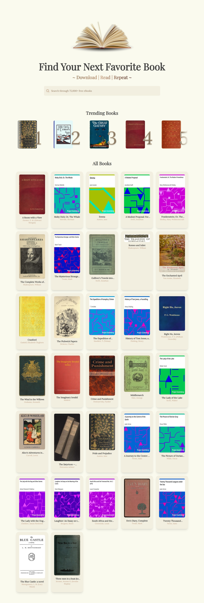
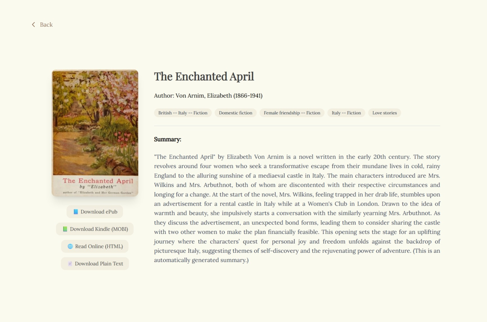

# 📚 Book Lookup Build

A React-based web application for searching and viewing public domain books from the [Gutendex API](https://gutendex.com/).  
Users can browse book details, download available formats, explore subjects, and read summaries — all with a clean, responsive Tailwind CSS interface.

---

## 🚀 Features

- **Intuitive Search** – Users can search books by title, author, or keywords with a smart debounced input to optimize API calls.
- **Trending Books Section** – Highlights currently popular books, powered by Appwrite’s backend analytics.
- **Book Details Page** – Displays:
  - Download links in multiple formats
  - Subject tags
  - Book summary
- **Responsive Design** – Fully optimized for desktop, tablet, and mobile.
- **Clean UI** – Styled with Tailwind CSS for modern and accessible design.
- **Error Handling & Loading States** – Clear feedback when no results are found or when data is loading.
- **Backend Integration** – Utilizes Appwrite for backend services, including search count updates and trending data retrieval.


---

## 🛠️ Tech Stack

- **Frontend:** React (Hooks & Debouncing), Tailwind CSS
- **Backend:** Appwrite
- **Data Source:** [Gutendex API](https://gutendex.com/)
- **Build Tool:** Vite 

---

## 📦 Installation

1. **Clone the repository**
   ```bash
   git clone https://github.com/TMinnie/book-lookup-build.git
   cd book-lookup-build
2. **Install dependencies**
   ```bash
   npm install

3. **Run the development server**
    ```bash
    npm run dev

4. **Open your browser at:**
http://localhost:5173

## What I Learned
Efficient API integration and handling asynchronous data in React.

Managing backend services with Appwrite to add custom functionality beyond public APIs.

Implementing debounced search inputs to reduce unnecessary network requests.

Designing a clean, modern, and accessible UI with Tailwind CSS.

Handling edge cases and improving UX with loading indicators and error messages.

## 📷 Screenshots


